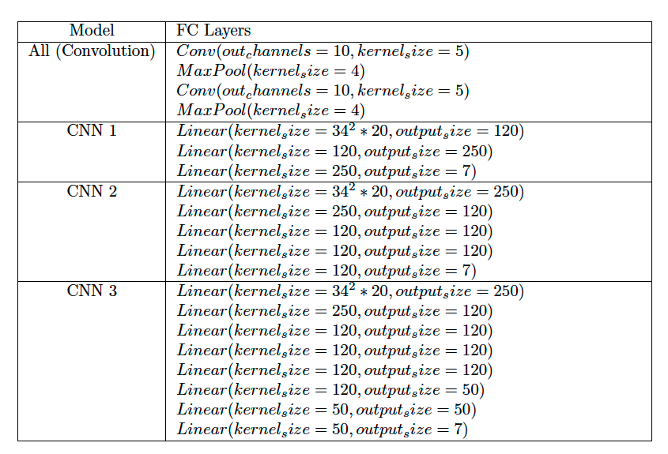
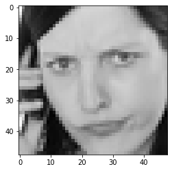
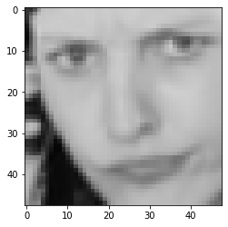
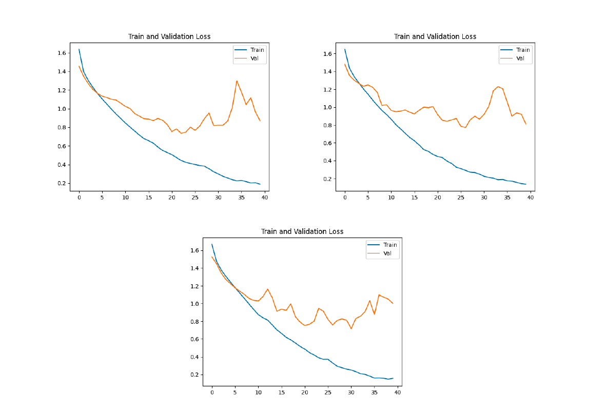
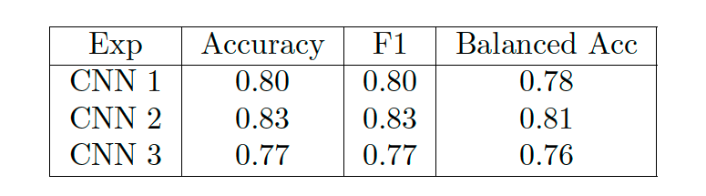
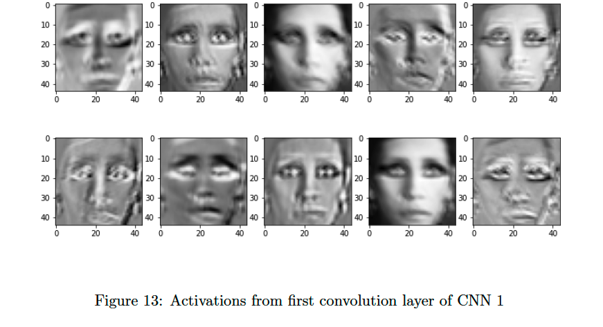

# CV-Assignment-2

## Run an experiment

```
root/
  ├── .gitignore
  ├── utils.py
  ├── run_experiment.py
  ├── README.md
  ├── models/
  ├── data/
  ├── dataset/
  ├── preprocessing/
  └── experiments/
          └── experiment1/
              └── config.py
```

In order to create a new experiment, clone one of the experiments folder and edit the `config.py` file with your information. You must have a GPU for it to work otherwise it won't run.
Also, dowload this data `https://www.kaggle.com/ashishpatel26/facial-expression-recognitionferchallenge` and have the `.csv` in the `data` directory.
```zsh
    python3 run_experiment.py -f <exp_folder_name>
```

## Architecture



## Dataset

The original dataset is a grayscale image(originall in a different representation), as an experiment, we implement a model for facial landmarking to crop faces from images and compare accuracy. The motivation for cropping the faces is to reduce noise from the images and highlight useful features.





## Results

The highest accuracy we received is ~80% on validation, which surpasses the current higest accuracy in the kaggle competition(from where the dataset is taken). Below are the results.




## The Horror that lasts a lifetime

We decided to interpret the results from our CNN layers to understand the representations that each layer learns for an image.



## Report
The report attached goes into much more details and is an interesting read(in our view 📚)
